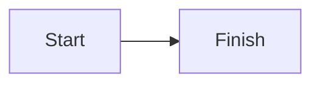

# Mermaid Office Design

## 1. Product vision

Mermaid Office is a lightweight, client-side Microsoft Word add-in for creating,
viewing, copying, and editing Mermaid diagrams as document-native pictures.

The add-in uses a focused task-pane editing experience:

- a **Mermaid** command is available from the **Insert** ribbon;
- diagrams appear in the document as ordinary pictures;
- selecting a Mermaid diagram allows a user with the add-in to edit its source;
- editing happens in a code-only task pane with live preview directly in Word;
- valid edits replace the rendered picture without changing its intended size or
  document position.

People who do not have Mermaid Office must still be able to view, print, export,
resize, and copy the rendered picture. They do not need the add-in unless they
want to edit the Mermaid source.

## 2. Goals

1. Support modern Word on the web, Word on Windows, and Word on macOS.
2. Add a **Mermaid** button to Word's **Insert** ribbon.
3. Insert an initial diagram using a simple default flowchart.
4. Display diagrams as SVG where Word supports SVG insertion and as PNG
   otherwise.
5. Keep the original Mermaid source with the diagram so it remains editable.
6. Open one code-only task pane for creating or editing a diagram.
7. Provide Mermaid-oriented syntax highlighting and editing behavior.
8. Parse continuously, show useful errors, and identify the failing source
   location when Mermaid provides one.
9. Show live diagram updates in Word without sending source or document content to a
   server.
10. Preserve editability when diagrams are copied and pasted within a document
    or between Word documents, where the Word client preserves embedded image
    metadata.
11. Keep startup time, bundle size, and runtime work as small as practical.
12. Add selectable Mermaid render themes after the core editing workflow is
    stable.

## 3. Non-goals

- A server, database, account system, or cloud synchronization service.
- Collaborative source editing beyond Word's existing document collaboration.
- Editing arbitrary SVG or PNG pictures that were not created by Mermaid
  Office.
- Recreating Mermaid's parser or rendering engine.
- Supporting legacy Word clients, VSTO, or COM add-ins.
- Guaranteeing source recovery after external tools strip picture metadata.
- Autocompletion in the first production milestone.

## 4. Supported clients and rendering

| Client | Create/update format | View existing diagram | Edit source |
| --- | --- | --- | --- |
| Word on Windows | SVG when ImageCoercion 1.2 is available; PNG fallback | Yes | Yes |
| Word on macOS | SVG when ImageCoercion 1.2 is available; PNG fallback | Yes | Yes |
| Word on the web | PNG | Yes | Yes |
| Word without the add-in | Existing SVG or PNG | Yes | No |

SVG is the preferred representation because Mermaid produces SVG natively and
vector output remains sharp when resized, printed, or exported to PDF.

At runtime, the add-in checks:

```ts
Office.context.requirements.isSetSupported("ImageCoercion", "1.2")
```

Supported clients receive SVG through `Office.CoercionType.XmlSvg`. Other
clients receive a PNG rasterized locally from the same sanitized SVG. No
rendering service is involved.

Word on the web is not currently listed by Microsoft as supporting
ImageCoercion 1.2 for Word. It must therefore use PNG when creating or updating
a diagram. Display of desktop-inserted SVG must be covered by compatibility
tests, including Word's package-level fallback behavior.

## 5. User experience

### 5.1 Insert a diagram

1. The user selects **Insert > Mermaid** to open the task pane.
2. With no diagram selected, the pane shows a default flowchart source.
3. The user can edit the source, then press **Insert** at an empty document cursor.
4. The inserted picture is wrapped in a tagged content control. Subsequent valid
   edits update that picture directly in Word.

The initial source is intentionally simple:



Opening the pane never inserts a diagram automatically.

### 5.2 Edit a diagram

The preferred interaction is:

1. The user right-clicks a Mermaid diagram.
2. Word shows **Edit Mermaid** only for that diagram.
3. The command identifies the wrapping content control and diagram UUID.
4. Mermaid Office opens the editor with the stored source and settings.

Office.js currently permits Word context-menu extensions for text
(`ContextMenuText`), but it does not expose the context menu for picture
objects. Consequently, this exact interaction cannot currently be implemented
by a cross-platform web add-in.

The supported interaction is:

- select a Mermaid diagram;
- Word raises `DocumentSelectionChanged`;
- the add-in requires a selected inline picture and resolves its parent control;
- the add-in validates that the content-control tag starts with the supported
  `mermaid-office:` schema marker and extracts the UUID;
- the open task pane automatically loads the stored source and settings;
- if the pane is closed, the user opens it using **Insert > Mermaid**.

An image right-click command remains a future enhancement if Microsoft exposes
that extension point. The product must not emulate a native context menu with
fragile pointer overlays. When the extension point becomes available, it should
reuse the same selection resolution and edit command rather than introduce a
second editing path.

### 5.3 Editor pane

The code-only task pane is the sole editor surface:

- theme selection above the source editor;
- System UI code font at 12 px;
- **Insert** at bottom left only for a new diagram;
- **Mermaid syntax** at bottom right;
- errors below the code editor, with inline diagnostics where possible;
- confirmation before switching diagrams with pending edits;
- explicit retry after a failed Word update.

The pane renders Mermaid locally and directly updates Word through Office.js.
There is no editor dialog, dialog messaging, or separate preview canvas:

```text
Word document
    ↕ Office.js
code-only task pane
```

New diagrams require explicit insertion. Existing diagrams update after a
600 ms pause in typing. Writes are serialized and stale renders are discarded.
Live preview changes are real document edits and may create undo/AutoSave entries.

### 5.4 Error handling

- The Word picture updates after a short debounce.
- The last valid picture remains visible while the current source is invalid.
- Parse errors never overwrite the document.
- **Insert** and live updates are disabled while the source is invalid or rendering.
- Errors include line and column information when Mermaid exposes it.
- Word insertion and replacement errors are shown explicitly and leave the
  existing picture unchanged.

### 5.5 Themes

Theme selection is a late-stage feature. Initial candidates are Mermaid's
supported built-in themes:

- Default
- Neutral
- Dark
- Forest

The selected theme is stored with the diagram, not as a global-only setting.
Changing a theme rerenders and updates an inserted diagram after the debounce.

## 6. Diagram object model

A Mermaid diagram is represented by:

1. a visible SVG or PNG picture;
2. a rich-text content control wrapping the picture;
3. a short content-control tag identifying the object;
4. a versioned portable payload containing the Mermaid source and settings;
5. an optional document-level index for recovery and efficient lookup.

Example content-control tag:

```text
mermaid-office:v1:550e8400-e29b-41d4-a716-446655440000
```

Example payload:

```json
{
  "schemaVersion": 1,
  "id": "550e8400-e29b-41d4-a716-446655440000",
  "source": "flowchart LR\n    A[Start] --> B[Finish]",
  "theme": "default",
  "size": "medium",
  "format": "svg",
  "rendererVersion": "11.17.2"
}
```

The schema is versioned independently of the add-in. Readers must reject newer
unsupported schemas with a clear message rather than silently losing data.

## 7. Source storage and copy/paste

No single Word metadata mechanism satisfies same-document editing,
cross-document copy/paste, and recovery on every client. The source is
therefore stored redundantly.

### 7.1 Portable copy

The rendered asset carries the canonical portable payload:

- SVG: encoded JSON in a dedicated `<metadata id="mermaid-office">` element.
- PNG: encoded JSON in a namespaced `iTXt` chunk.

This allows the source to travel with the picture when Word preserves the
original asset bytes during copy/paste.

The payload must not contain executable content. SVG is sanitized before
insertion, and payload decoding validates size, schema, and field types.

### 7.2 Word object identity

The wrapping content control stores only a compact schema marker and UUID in
its tag. It gives the add-in a stable object boundary for selection, replacement,
and same-document lookup. Full source is not placed in the tag because tags have
practical size limits.

### 7.3 Document recovery index

A custom XML part may maintain a UUID-to-payload index. It is a cache and
recovery mechanism, not the only source of truth, because custom XML data may
not accompany native copy/paste into another document.

### 7.4 Copy/paste behavior

When a pasted Mermaid diagram is first detected:

1. Read and validate the payload embedded in SVG or PNG.
2. Create a new UUID if the destination already contains that UUID.
3. Restore or retag the content-control wrapper when Word did not copy it.
4. Add the payload to the destination document index.
5. Preserve the rendered format until the next edit.

Copy/paste must be tested across all source/destination combinations:

- same document;
- two desktop documents;
- desktop to Word web;
- Word web to desktop;
- documents stored locally and in OneDrive/SharePoint;
- SVG and PNG;
- copy/paste, duplicate, save/reopen, and coauthoring round trips.

Metadata preservation by Word must be proven with prototypes. If a client strips
both the wrapper and embedded payload, the picture remains viewable but cannot
be made editable without another copy of the source. The UI must identify it as
an ordinary picture rather than imply that recovery is possible.

## 8. Updating an existing diagram

Updating should be transactional from the user's perspective:

1. Load and validate the selected diagram payload.
2. Open the editor with a copy of the current source and settings.
3. Render and sanitize the replacement.
4. Capture the existing width, height, title/alt text, and placement.
5. Replace the picture inside the same content control.
6. Restore intended dimensions and accessibility metadata.
7. Update embedded payload and document index.
8. Commit changes only after the replacement succeeds.

Discarding or closing the editor leaves the document untouched.

## 9. Accessibility

- Inserted pictures receive a meaningful title such as `Mermaid diagram`.
- The initial alt text is derived conservatively from the diagram type and may
  be edited by the user in Word.
- Editor controls have accessible names and full keyboard operation.
- Errors are announced with an ARIA live region and are not communicated by
  color alone.
- Preview contrast follows the selected theme.

Mermaid source must not be copied wholesale into alt text because it is often
too verbose and is not an equivalent textual description.

## 10. Security and privacy

- All rendering happens in the client.
- Diagram source and document content are not transmitted to Mermaid Office
  servers; there are no Mermaid Office application servers.
- Static assets are hosted on GitHub Pages over HTTPS.
- Office.js is loaded from Microsoft's production CDN.
- Mermaid runs with `securityLevel: "strict"`.
- Rendered SVG is sanitized with DOMPurify before preview or insertion.
- External links, remote images, scripts, event handlers, and unsafe URL schemes
  are removed or disabled.
- Embedded payload size is capped to prevent document abuse and excessive
  memory use.
- Dependency versions are locked and audited during releases.

## 11. Technical architecture

### 11.1 Stack

| Concern | Technology |
| --- | --- |
| Language | TypeScript |
| UI | React |
| UI components | Fluent UI React v9 |
| Build | Vite |
| Word integration | Office.js |
| Rendering | Mermaid.js |
| Editing | CodeMirror 6 |
| SVG sanitization | DOMPurify |
| Tests | Vitest and Testing Library |
| Hosting | GitHub Pages |

### 11.2 Application surfaces

The static web application has one entry point, `index.html`, which always opens
the task pane. The manifest uses `ShowTaskpane`; no function-command runtime or
editor dialog is needed. Old `?view=pane` links still open the same pane.

Shared rendering, payload, and validation modules are framework-light
TypeScript so they can be tested without Word.

### 11.3 Proposed modules

```text
src/
  main.tsx
  pane/
    PaneApp.tsx
    usePaneEditor.ts
  editor/
    MermaidEditor.tsx
    diagnostics.ts
  mermaid/
    render.ts
    sanitize.ts
    themes.ts
  metadata/
    payload.ts
    svgMetadata.ts
    pngMetadata.ts
    documentIndex.ts
  word/
    selection.ts
    contentControls.ts
    insertDiagram.ts
    replaceDiagram.ts
  shared/
    errors.ts
    ids.ts
```

### 11.4 Lightweight strategy

- Bundle Mermaid rather than loading arbitrary third-party runtime code.
- Lazy-load the editor, Mermaid, and diagram-specific renderer chunks only when
  the pane is opened.
- Use CodeMirror instead of Monaco.
- Avoid state-management, routing, and component libraries beyond what the
  product needs.
- Debounce rendering and cancel stale preview results.
- Measure compressed initial and editor bundle sizes as release criteria.

## 12. Ribbon and command design

The production manifest adds a Mermaid group to Word's built-in **Insert** tab:

- **Mermaid** — open the code-only task pane to insert or edit a diagram.

The task pane monitors `DocumentSelectionChanged`. It loads a diagram only when
an actual selected picture has a valid Mermaid Office tag and payload.
Selection checks are serialized and guarded so rapid cursor movement
does not queue overlapping `Word.run` operations.

The same button handles new and existing diagrams. There is no second editing
command or expanded editor.

### 12.1 Editor component choice

The editor uses CodeMirror 6 rather than Monaco. Monaco provides a powerful IDE
experience, but Mermaid has no first-party Monaco language service, and Monaco
would materially increase download, parsing, and startup cost. CodeMirror
provides the required syntax styling, diagnostics, keyboard behavior, and
future completion extension points with a much smaller footprint.

Monaco can be reconsidered only if later requirements depend on Monaco-specific
capabilities that cannot reasonably be implemented with CodeMirror.

## 13. Autocompletion

Autocompletion is desirable but not a launch requirement. A later milestone may
provide:

- diagram-type keywords;
- common node and edge syntax;
- directive and theme configuration keys;
- snippets for supported Mermaid diagram types.

Completion should be implemented as a small CodeMirror extension. It must not
require a language server or network service.

## 14. Delivery plan

### Phase 1: platform spikes

- Add the Insert ribbon command.
- Add automatic selection-aware source loading in the task pane.
- Prove default SVG insertion on supported Windows and Mac clients.
- Prove PNG insertion on Word web.
- Verify content-control wrapping and selection detection.
- Verify SVG `<metadata>` and PNG `iTXt` preservation through save and
  cross-document copy/paste.
- Verify that desktop-inserted SVG remains visible in Word web.
- Prove direct task-pane document replacement.

These spikes decide the final persistence behavior. They should happen before
polishing the editor.

### Phase 2: minimum viable workflow

- Insert the default flowchart.
- Open the task pane and load the selected diagram automatically.
- Add syntax highlighting, debounced preview, and parse-error reporting.
- Save SVG or PNG back into the existing content control.
- Preserve size and document position.
- Recover source after save/reopen and supported copy/paste paths.

### Phase 3: compatibility and quality

- Complete the platform copy/paste matrix.
- Add accessibility behavior and keyboard shortcuts.
- Add robust corruption, unsupported-version, and lost-metadata messages.
- Optimize command startup and lazy-loaded bundles.
- Add end-to-end tests on Word Windows, Mac, and web.

### Phase 4: product features

- Add render theme selection.
- Add lightweight autocompletion and snippets.
- Consider templates and export options.
- Revisit native right-click integration if Microsoft expands Office.js.

### Phase 5: publishing

- Finalize icons, localization-ready strings, support page, and privacy policy.
- Test the production GitHub Pages deployment.
- Validate the manifest and all declared requirement sets.
- Complete Microsoft Marketplace certification testing.

## 15. Acceptance criteria

The first production release is complete when:

1. The add-in can be installed and opened in current Word web, Windows, and Mac.
2. **Insert > Mermaid** opens the pane; **Insert** creates a diagram at an empty cursor.
3. A recipient without the add-in sees the rendered picture.
4. A user with the add-in can select a Mermaid diagram and open **Mermaid**.
5. The pane loads the exact stored source and previews valid edits in Word.
6. Invalid source shows an actionable error and cannot replace the document
   picture.
7. Saving valid source updates the picture while preserving its intended size
   and location.
8. SVG is used on clients supporting ImageCoercion 1.2; PNG is used elsewhere.
9. Source survives save/reopen and every copy/paste route proven supported by
   the Phase 1 matrix.
10. No diagram or document content is sent to an application server.
11. The add-in remains responsive with representative large flowcharts,
    sequence diagrams, and architecture diagrams.

## 16. Risks and open questions

| Risk or question | Planned response |
| --- | --- |
| Word strips custom SVG or PNG metadata during some copy/paste paths | Test early; use redundant embedded and document storage; document unsupported recovery paths |
| Native image right-click extension is unavailable | Use the Mermaid ribbon button and automatic selection tracking in the pane |
| Word web cannot insert SVG through ImageCoercion 1.2 | Insert PNG locally on web |
| Live preview creates real document edits | Debounce and serialize writes; retain the last valid picture on parse errors |
| SVG replacement changes sizing or placement | Capture dimensions and replace within the existing content control |
| Mermaid parser errors lack stable location information | Normalize available parser details and show a clear general error otherwise |
| Large Mermaid/editor bundles slow startup | Lazy-load diagram renderer code in the pane |
| Mermaid behavior changes across releases | Lock the version and store `rendererVersion` in diagram metadata |

## 17. Authoritative platform references

- [Add-in commands](https://learn.microsoft.com/office/dev/add-ins/design/add-in-commands)
- [Create add-in commands with the add-in-only manifest](https://learn.microsoft.com/office/dev/add-ins/develop/create-addin-commands)
- [Image Coercion requirement sets](https://learn.microsoft.com/javascript/api/requirement-sets/common/image-coercion-requirement-sets)
- [ContextMenu extension point](https://learn.microsoft.com/javascript/api/manifest/extensionpoint)
- [Office ribbon API](https://learn.microsoft.com/javascript/api/office/office.ribbon)
- [Word document selection changed event](https://learn.microsoft.com/javascript/api/office/office.documentselectionchangedeventargs)
